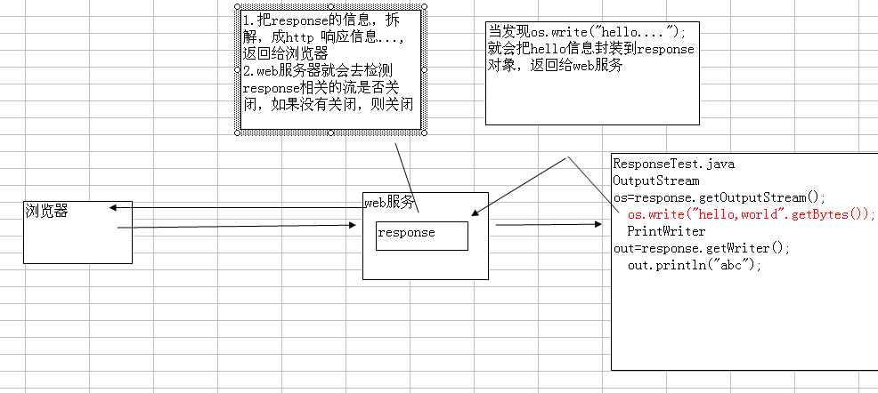

##1. getWriter()和getOutputStream()的区别

1.	getWriter() 用于向客户机回送字符数据
2.	getOutputStream() 返回的对象，可以回送字符数据，也可以回送字节数据(二进制数据)
	OutputStream os=response.getOutputStream();
	os.write("hello,world".getBytes());

如何选择:
如果我们是回送字符数据，则使用PrintWriter对象 ,效率高
如果我们是回送字节数据(binary date) ,则只能使用 OutputStream
这两个流不能同时使用.
比如：
	
	OutputStream os=response.getOutputStream();
		os.write("hello,world".getBytes());
		PrintWriter out=response.getWriter();
		out.println("abc");
		
就会报错:

	java.lang.IllegalStateException: getOutputStream() has already been called for this response

Web服务器会自动检查并关闭流
从该图，我们也可以看出. 为什么我们没有主动关闭流，程序也没有问题的原因.
最好主动关闭流.

##2. 参数的传递方式sendRedirect()和session()
需求: 当用户登录成功后，把该用户名字显示在登录成功页面

①使用sendRedirect()来传递字符参数
解决思路:
1.	使用java基础 static

2.	使用sendRedirect()
代码:

	response.sendRedirect("/UsersManager/MainFrame?uname="+username+"&pwd="+password);
	
基本格式:

	response.sendRedirect(“servlet的地址?参数名=参数值&参数名=参数值...”);

参照值是String , 参数名应当使用字母组合
在接受数据的Servlet中使用`String 参数=request.getParameter(“参数名”);`获取。

3.	使用session传递
A.传递字符串
放入session   request.getSession.setAttribute("loginUser",username); 
取出session	 在JSP中通过session取出 request.getSession.getAttribute("loginUser");
B．传递对象
User user= new User();
user.setName(“xiaoli”);
user.setPassWord(“123”);

放入session   request.getSession.setAttribute("userObj",userObj); 
取出session	 User user=(User)request.getSession.getAttribute(“userObj”);

