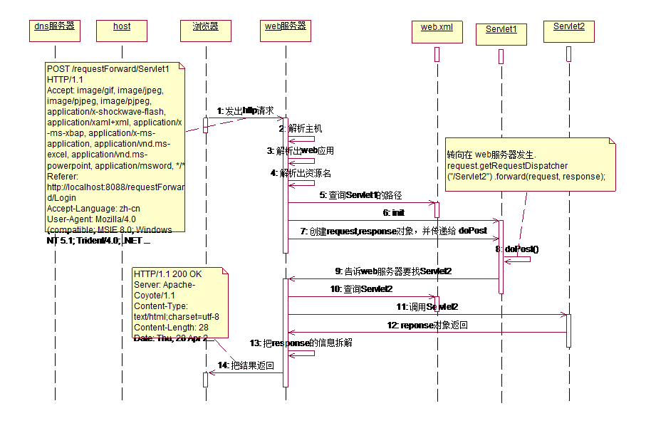

##1. getWriter()和getOutputStream()的区别

1.	getWriter() 用于向客户机回送字符数据
2.	getOutputStream() 返回的对象，可以回送字符数据，也可以回送字节数据(二进制数据)
	OutputStream os=response.getOutputStream();
	os.write("hello,world".getBytes());

如何选择:
如果我们是回送字符数据，则使用PrintWriter对象 ,效率高
如果我们是回送字节数据(binary date) ,则只能使用 OutputStream
这两个流不能同时使用.
比如：
	
	OutputStream os=response.getOutputStream();
		os.write("hello,world".getBytes());
		PrintWriter out=response.getWriter();
		out.println("abc");
		
就会报错:

	java.lang.IllegalStateException: getOutputStream() has already been called for this response

Web服务器会自动检查并关闭流
从该图，我们也可以看出. 为什么我们没有主动关闭流，程序也没有问题的原因.
最好主动关闭流.

##2. 参数的传递方式sendRedirect()和session()
需求: 当用户登录成功后，把该用户名字显示在登录成功页面

①使用sendRedirect()来传递字符参数
解决思路:
1. 使用java基础 static

2. 使用sendRedirect()
代码:

	response.sendRedirect("/UsersManager/MainFrame?uname="+username+"&pwd="+password);
	
基本格式:

	response.sendRedirect(“servlet的地址?参数名=参数值&参数名=参数值...”);

参照值是String , 参数名应当使用字母组合
在接受数据的Servlet中使用`String 参数=request.getParameter(“参数名”);`获取。

3. 使用session传递

A.传递字符串

	放入session   request.getSession.setAttribute("loginUser",username); 
	取出session	 在JSP中通过session取出 request.getSession.getAttribute("loginUser");
	
B．传递对象

	User user= new User();
	user.setName(“xiaoli”);
	user.setPassWord(“123”);

	放入session   request.getSession.setAttribute("userObj",userObj); 
	取出session	 User user=(User)request.getSession.getAttribute(“userObj”);

##3. 编码问题（处理中文乱码）

发生中文乱码有三种情况

①表单form 

(1)	post
	在服务器端设置成浏览器端的编码方式。
	
	解决方法:  request.setCharacterEncoding("utf-8"); //gbk gb2312 big5

(2)	get
写一个工具类:
	package com.humbinal.utils;
	public class MyTools {
		public static String getNewString(String str) {
			String newString="";
			try {
				newString=new String(str.getBytes("iso-8859-1"),"utf-8");
			} catch (Exception e) {
				e.printStackTrace();
				// 把iso-8859-1 转换成 utf-8
			} 
			return newString;
		}
	}
	
②超链接

	<a href=”http://www.sohu.com?name=中文”>测试</a>
	该类型和get处理方法一样.

③sendRedirect() 发生乱码

	response.sendRedirect(“servlet地址?username=中文”); 
	在接收页面进行转码

版本低导致的乱码 
特别说明，如果你的浏览器是 ie6 或以下版本，则我们的 ② 和 ③中情况会出现乱码(当中文是奇数的时候)
解决方法是 ：
String info=java.net.URLEncoder.encode("你好吗.jpg", "utf-8");
<a href=”http://www.sohu.com?name=”+ info >测试</a>
response.sendRedirect(“servlet地址?username=”+info);
说明: 我们应当尽量使用post 方式提交;
☞返回浏览器显示乱码 
在服务端是中文，在response的时候，也要考虑浏览器显示是否正确,一般我们通过
response.setContentType(“text/html;charset=utf-8”); ok

☞下载提示框中文乱码
补充一个知识点: 当我们下载文件的时候，可能提示框是中文乱码 
String temp=java.net.URLEncoder.encode("传奇.mp3","utf-8");
response.setHeader("Content-Disposition","attachment; filename="+temp);

##4. HttpServletRequest对象

该对象表示浏览器的请求(http请求), 当web 服务器得到该请求后，会把请求信息封装成一个HttpServletRequest 对象
	
	getRequestURL方法返回客户端发出请求时的完整URL。
	getRequestURI方法返回请求行中的资源名部分。
	getQueryString 方法返回请求行中的参数部分(参数名+值)。
	
该函数可以获取请求部分的数据 比如

	http://localhost/web名?username=abc&pwd=123
	request.getQueryString(); 就会得到  username=abc&pwd=123

	getRemoteAddr方法返回发出请求的客户机的IP地址
	getRemoteHost方法返回发出请求的客户机的完整主机名
	getRemotePort方法返回客户机所使用的网络端口号
	客户机的端口号是随机选择的，web服务器的端口号是一定的
	getLocalPort方法返回web服务器所使用的网络端口号
	getLocalAddr方法返回WEB服务器的IP地址。
	getLocalName方法返回WEB服务器的主机名
	
url 和 uri 的区别
比如：

	Url=http://localhost:8088/servletPort3/GetinfoServlet 完整的请求
	Uri=/servletPort3/GetinfoServlet web应用的名称+资源的名称

如何获取用户通过表单提交的内容

	response.setContentType("text/html;charset=utf-8");
	PrintWriter out = response.getWriter();
	out.println("<form action='/servletPro3/RegisterCl' method='post'> ");
	out.println("<input type='hidden' value='abc' name='hidden1'/>");
	out.println("用户名:<input type='text' name='username'/> ");
	out.println("密　码:<input type='password' name='pwd'/> ");
	out.println("性　别:<input type='radio' name='sex' value='男'/>男 <input type='radio' name='sex' value='女'/>女 ");
	out.println("你的爱好:<input type='checkbox' name='hobby' value='音乐'>音乐 <input type='checkbox' name='hobby' value='体育'>体育 <input type='checkbox' name='hobby' value=\"旅游\">旅游 ");
	out.println("所在城市:<select name='city'><option value='bj'>北京</option><option value='cq'>重庆</option></select> ");
	out.println("你的介绍:<textarea cols='20' rows='10' name='intro' >请输入介绍..</textarea> ");
	out.println("提交照片:<input type='file' name='photo'> ");
	//什么时候使用hidden传输数据 1.不希望用户看到该数据 2. 不希望影响节目，同时使用该数据
	
	out.println("<input type='submit' value='提交信息'/>");
	out.println("</form>");

根据上面的表单可以如下获取：

	request.setCharacterEncoding("utf-8");
	response.setContentType("text/html;charset=utf-8");
	PrintWriter out = response.getWriter();
	String u=request.getParameter("username");
	String p=request.getParameter("pwd");
	String sex=request.getParameter("sex");
	//如果接受复选框的内容，则使用getparameterValues
	String [] hobbies=request.getParameterValues("hobby");
	String city=request.getParameter("city");
	String intro=request.getParameter("intro");
	String hidden1=request.getParameter("hidden1");
	out.println("用户名="+u+" ");
	out.println("密　码="+p+" ");
	out.println("性  别="+sex+" ");
	if(hobbies!=null){
		for(int i=0;i<hobbies.length;i++){
			out.println("爱好:"+hobbies[i]);
		}
	}else{
		out.println("你没有爱好");
	}
	out.println(" 所在城市:"+city);
	out.println(" 个人介绍:"+intro);
	out.println(" 隐藏控件数据:"+hidden1);

请求转发requeset.getRequestDispatcher(资源地址).forward(request,response);

资源地址：不需要项目名。因为它只是在WEB服务器内部转发。
Request.getRequestDispatcher(资源地址).forward(request,response);
我们现在使用 请求转发的方法来实现上次我们使用 response.sendRedirect() 实现效果
使用 request提供的转发方法.

Request中的Attribute在一次请求有效。一次请求：没有返回到浏览器，就为一次请求。

1.	使用 forward 不能转发到 该web应用外的 url
2.	因为 forward 是发生在web服务器，所以 Servlet1 和 Servlet 2使用的是用一个request 和response.
	使用sendRedirect() 方法不能通过request.setAttribute() 把 属性传递给下一个Servlet

比较sendRedirect()和request.getRequestDispatcher().forward(request,response)

(1)sendRedirect() 重定向,转发  forward() 叫转向

(2)实际发生的位置不一样
sendRedirect 发生在浏览器
forward 发生在web服务器

(3)用法不一样
request.getRequestDispatcher(“/资源URI”).forward(request,response)
response.sendRedirect(“/web应用/资源URI”);

(4)能够访问的URL范围不一样
sendRedirect 可以访问内部和外部URL
forward 只能访问当前的WEB应用的资源

