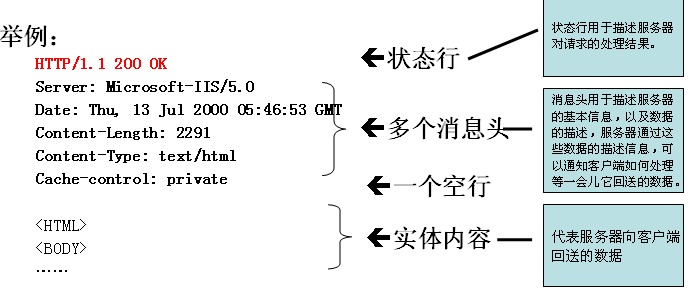

##1.http协议简述

①http协议是建立在tcp/ip协议基础上
②http协议全称 超文本传输协议
③http协议1.0(短连接) , 1.1(长连接) ，目前通用的是1.1版本
所谓长和短指的是持续时间;长连接(1.1) 30s ，短连接是发送完数据就断掉. 

##2.http的请求部分
基本结构:

	GET /test/hello.html HTTP/1.1 [请求行]
	Accept: */*  [消息名]  消息名：内容
	Referer: http://localhost:8080/test/abc.html  
	Accept-Language: zh-cn
	User-Agent: Mozilla/4.0 
	Accept-Encoding: gzip, deflate  
	Host: http://www.sohu.com:80
	Connection: Keep-Alive     [消息头格式 （消息名: 内容 ）
	空行
	发送的内容 [格式 : 内容名字=内容体]
	
特别说明： 并不是每一次请求的消息头都一样.]
请求方式
请求行中的GET称之为请求方式，请求方式有：POST,GET,HEAD,OPTIONS,DELETE,TRACE,PUT
常用的有：POST,GET

##3.http请求消息头
1. Accept: text/html,image/*   [告诉服务器，我可以接受 文本，网页，图片]
2. Accept-Charset: ISO-8859-1 [接受字符编码 iso-8859-1]
3. Accept-Encoding: gzip,compress [可以接受 gzip,compress压缩后数据.]
4. Accept-Language: en-us,zh-cn [浏览器支持中，英文]
5. Host: www.sohu.com:80 [我要找主机是 www.sohu.com:80]
6. If-Modified-Since: Tue, 11 Jul 2000 18:23:51 GMT [ 告诉服务器，我的缓冲中有这个资源文件，该文件的时间是...]
7. Referer: http://www.sohu.com/index.jsp  [告诉服务器，我来自哪里,该消息头，常用于防止盗链]
8. User-Agent: Mozilla/4.0 (compatible; MSIE 5.5; Windows NT 5.0)[告诉服务器，浏览器内核]
9. Cookie [cookie??]
10.	Connection: close/Keep-Alive   [保持连接，发完数据后，我不关闭连接]
11. Date: Tue, 11 Jul 2000 18:23:51 GMT [浏览器发送该http请求的时间]

Referer的应用(防盗链):
//获取用户浏览器Referer
	String referer=request.getHeader("Referer");
	if(referer==null||!referer.startsWith("http://localhost:8080/servlet")){
		response.sendRedirect("/servlet/Error");
		return;
	}

##4.http响应
基本结构:

1.状态行：
格式：HTTP版本号 状态码 状态描述
举例：HTTP/1.1 200 OK
状态码			含义
100-199		表示成功接收请求，要求客户端继续提交下一次请求才能完成整个处理过程
200-299		表示成功接收请求并完成整个处理过程，常用200
300-399		为完成请求，客户需要进行一步细化请求。例如：请求的资源已经移动一个新的地址，常用302,307
400-499		客户端的请求有错误 404
500-599		服务器端出现错误，常用500

http响应的状态行举例说明
200 就是整个请求和响应过程没有发生错误，这个最常见.
302: 表示当你请求一个资源的时候，服务器返回302 表示，让浏览器转向到另外一个资源，比如: response.sendRedirect(“/web应用/资源名”)

案例:
	response.setStatus(302);
	response.setHeader("Location", "/servletPro/Servlet2");
	// 上面两句话等价	response.sendRedirect("/servletPro/Servlet2");

404： 找不到资源
500: 服务器端错误

2.http响应消息头
	Location: http://www.baidu.org/index.jsp  【让浏览器重新定位到url】
	Server:apache tomcat 【告诉浏览器我是tomcat】
	Content-Encoding: gzip 【告诉浏览器我使用 gzip】
	Content-Length: 80  【告诉浏览器会送的数据大小80节】
	Content-Language: zh-cn 【支持中文】
	Content-Type: text/html; charset=GB2312 [内容格式text/html; 编码gab2312]
	Last-Modified: Tue, 11 Jul 2000 18:23:51 GMT 【告诉浏览器，该资源上次更新时间】
	Refresh: 1;url=http://www.baidu.com 【过多久去，刷新到 http://www.baidu.com】
	Content-Disposition: attachment; filename=aaa.zip 【告诉浏览器，有文件下载】
	Transfer-Encoding: chunked  [传输的编码]
	Set-Cookie:SS=Q0=5Lb_nQ; path=/search[后面详讲]
	Expires: -1[告诉浏览器如何缓存页面IE]
	Cache-Control: no-cache  [告诉浏览器如何缓存页面火狐]
	Pragma: no-cache   [告诉浏览器如何缓存页面]
	Connection: close/Keep-Alive   [保持连接 1.1是Keep-Alive]
	Date: Tue, 11 Jul 2000 18:23:51 GMT

