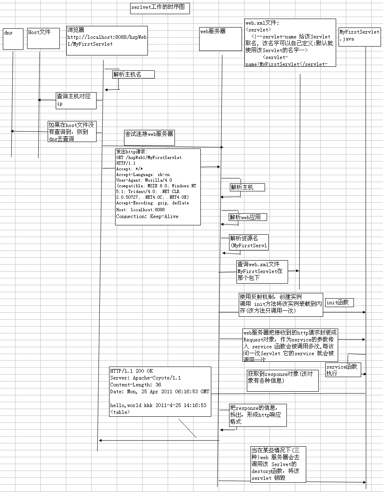

##1.☆servlet的生命周期(工作原理)

servlet的生命周期(工作流程)
1.WEB服务器首先会检查是否已经装载并创建了该servlet实例对象。如果是直接进行第④步，否则执行第②步。
2.装载并创建该Servlet的一个实例对象。
3.调用Servlet实例对象的init()方法。
4.创建一个用于封装HTTP请求消息的HttpServletRequest对象和一个代表HTTP响应消息的HttpServletResponse对象，然后调用service()方法并将请求和响应作为参数传递进去。
5.WEB应用被停止或重启之前，Servlet引擎将卸载Servlet，在卸载之前调用Servlet的destroy()方法。

1.	当serlvet 第一次被调用的时候，会触发init函数，该函数会把servlet实例装载到内存.init函数只会被调用一次。
2.	然后去调用servlet  的 service 函数。
3.	当第二次后访问该servlet 就直接调用 service 函数.
4.	当 web应用 reload 或者 关闭 tomcat 或者 关机 都会去调用destroy函数，该函数就会去销毁serlvet。

##2.Servlet的生命周期详解
当客户端第一次向web服务器发出一个servlet请求时，web服务器将会创建一个该servlet的实例，并且调用servlet的init()方法；如果当服务器已经存在了一个servlet实例，那么，将直接使用此实例；然后再调用service()方法，service()方法将根据客户端的请求方式来决定调用对应的doXXX()方法；当 web应用 reload 或者 关闭 tomcat 或者 关机，web服务器将调用destroy()方法，将该servlet从服务器内存中删除。
生命全过程：
1. 加载
2. 实例化
3. 初始化
4. 处理请求
5. 退出服务

##3.开发servlet的三种方法
1. 实现 Servlet接口
2. 通过继承 GenericServlet
3. 通过继承 HttpServlet

(1)实现Servlet接口
①代码：

	package com.servlet;

	import javax.servlet.*;
	import javax.servlet.http.*;  //为了能将servlet-api.jar包引入,需要配置环境变量
	import java.io.*;

	class MyFirstServlet implements Servlet{
		//该函数用于初始化servlet,就是把该servlet装载到内存中
		//该函数只会被调用一次
		public void init(ServletConfig config)
			  throws ServletException{
		}

		//得到ServletConfig对象
		public ServletConfig getServletConfig(){
			return null;
		}
	
		//该函数是服务函数,我们的业务逻辑代码就是写在这里
		//该函数每次都会被调用
		public void service(ServletRequest req,
						ServletResponse res)
				 throws ServletException,
						java.io.IOException{
			res.getWriter().println("hello,world!");
		}
		//该函数时得到servlet配置信息
		public java.lang.String getServletInfo(){
			return null;
		}
		//销毁该servlet,从内存中清除,该函数被调用一次
		public void destroy(){
		}
	}

②部署Servlet
根据serlvet规范，需要将Servlet部署到WEB-INF目录下的web.xml文件,该部署配置可以从examples下拷贝。

	<web-app .....>
		<servlet>
			<!--servlet-name 给该Servlet取名, 该名字可以自己定义:默认就使用该Servlet的名字-->
			<servlet-name>MyFirstServlet</servlet-name>③
			<!--servlet-class要指明该Servlet 放在哪个包下 的,形式是 包/包/../类-->
			<servlet-class>com.hsp.MyFirstServlet</servlet-class>④
		</servlet>
		<!--Servlet的映射-->
		<servlet-mapping>
			<!--这个Servlet-name要和上面的servlet-name名字一样-->
			<servlet-name>MyFirstServlet</servlet-name>②
			<!--url-pattern 这里就是将来访问该Servlet的资源名部分-->
			<url-pattern>/ABC</url-pattern>①
		</servlet-mapping>
	</web-app>
服务器调用流程：http://localhost:8088/ABC --->①--->②--->③--->④

(2)使用GenericServlet开发servlet
	
	package com.genericservlet;
	import javax.servlet.*;
	import javax.servlet.http.*;
	import java.io.*;
	public class MyGenericServlet extends GenericServlet
	{
		public  void service(ServletRequest req,
								 ServletResponse res)
						  throws ServletException,
								 java.io.IOException{
			res.getWriter().println("hello,world,i am geneirc servlet");
		}
	}
同样部署即可。

(3)继承 HttpServlet来开发Serlvet

	package com.httpservet;

	import javax.servlet.*;
	import javax.servlet.http.*;
	import java.io.*;

	public class MyHttpServlet extends HttpServlet
	{
		//在HttpServlet 中，设计者对post 提交和 get提交分别处理
		//<form action="提交给?" method="post|get"/>,默认是get

		protected void doGet(HttpServletRequest req,
						 HttpServletResponse resp)
				  throws ServletException,
						 java.io.IOException{
			resp.getWriter().println("i am httpServet doGet()");
			
		}
		protected void doPost(HttpServletRequest req,
						  HttpServletResponse resp)
				   throws ServletException,
						  java.io.IOException{ 
			resp.getWriter().println("i am httpServet doPost() post name="+req.getParameter("username"));
		}
	}

	★get提交和post的提交的区别
	①从安全看 get<post 因为get 会把提交的信息显示到地址栏
	②从提交内容看 get<post get 一般不要大于2k, post理论上无限制，但是在实际开发中，建议不要大于64k
	③从速度看 get>post
	④Get可以保留uri中的参数，利于收藏

##4.Servlet细节问题
1. 合并请求
	
	public void doGet(HttpServletRequest request, HttpServletResponse response)
			throws ServletException, IOException {

		response.setContentType("text/html");
		PrintWriter out = response.getWriter();
		out.println("hello "+new java.util.Date().toString() );
	}

	public void doPost(HttpServletRequest request, HttpServletResponse response)
			throws ServletException, IOException {

		this.doGet(request, response);
	}

2. 一个已经注册的Servlet可以被多次映射

	<servlet>
		<description>This is the description of my J2EE component</description>
		<display-name>This is the display name of my J2EE component</display-name>
		<!-- servlet的注册名 -->
		<servlet-name>MyServlet1</servlet-name>
		<!-- servlet类的全路径(包名+类名) -->
		<servlet-class>com.hsp.servlet.MyServlet1</servlet-class>
	</servlet>
	<!-- 对一个已经注册的servlet的映射 -->
	<servlet-mapping>
		<!-- servelt的注册名 -->
		<servlet-name>MyServlet1</servlet-name>
		<!-- servlet的访问路径 -->
		<url-pattern>/MyServlet1</url-pattern>
	</servlet-mapping>

	<servlet-mapping>
		<servlet-name>MyServlet1</servlet-name>
		<url-pattern>/aaa</url-pattern>//映射到多个
	</servlet-mapping>

3. 当映射一个servlet时候，可以多层。比如 
	<url-pattern>/servlet/index.html</url-pattern> ok
从这里还可以看出，后缀名是 html 不一定就是 html,可能是假象.

4. 使用通配符在servlet映射到URL中
有两种格式:
第一种格式  *.扩展名  比如 *.do  *.ss
第二种格式  以 / 开头 同时以 /* 结尾  比如  /*   /news/* 

当通配符设置如下时：
	Servlet1 映射到 /abc/* 
	Servlet2 映射到 /* 
	Servlet3 映射到 /abc
	Servlet4 映射到 *.do 

	当请求URL为“/abc/a.html”，“/abc/*”和“/*”都匹配，哪个servlet响应
	Servlet引擎将调用Servlet1。
	当请求URL为“/abc”时，“/abc/*”和“/abc”都匹配，哪个servlet响应
	Servlet引擎将调用Servlet3。
	当请求URL为“/abc/a.do”时，“/abc/*”和“*.do”都匹配，哪个servlet响应
	Servlet引擎将调用Servlet1。
	当请求URL为“/a.do”时，“/*”和“*.do”都匹配，哪个servlet响应
	Servlet引擎将调用Servlet2。
	当请求URL为“/xxx/yyy/a.do”时，“/*”和“*.do”都匹配，哪个servlet响应
	Servlet引擎将调用Servlet2。

在匹配的时候，要参考的标准:
(1)	看谁的匹配度高，谁就被选择
(2)	*.do 的优先级最低

5. ★Servlet单例问题
当Servlet被第一次访问后，就被加载到内存，以后该实例对各个请求服务.即在使用中是单例.
因为 Servlet是单例，因此会出现线程安全问题: 比如:
售票系统. 如果不加同步机制，则会出现问题:

使用原则:
（1）如果一个变量需要多个用户共享，则应当在访问该变量的时候，加同步机制
	synchronized (对象){
		//同步代码
	}
（2）如果一个变量不需要共享，则直接在 doGet() 或者 doPost()定义.这样不会存在线程安全问题

6. Servlet 中的 <load-on-startup>配置

当我们的网站启动的时候,可能会要求初始化一些数据，(比如创建临时表), 在比如:
我们的网站有一些要求定时完成的任务[ 定时写日志，定时备份数据.. 定时发送邮件..]
解决方法： 可以通过 <load-on-startup> 配合 线程知识搞定.
通过配置<load-on-startup> 我们可以指定某个Servlet 自动创建.

	SendMailThread.java
	package com.test.model;
	public class SendEmailThread extends Thread{
		@Override
		public void run() {
			int i=0;
			try {
				while(true){
					//每休眠一分钟，就去扫表sendmail, 看看那份信件应当被发出
					Thread.sleep(10*1000);
					System.out.println("发出 第"+(++i)+"邮件");//javamail
				}
			} catch (Exception e) {
				e.printStackTrace();
				// TODO: handle exception
			}
		}
	}
	
	MyInitServlet1.java
	public void init() throws ServletException {
			// Put your code here
			System.out.println("MyInitServlet1 的init被调用..");
			//完成一些初始化任务
			System.out.println("创建数据库，表，读取参数");
			//创建一个线程
			SendEmailThread sendEmailThread=new SendEmailThread();
			sendEmailThread.start();
		}
		
说明:

	<!-- 1表示该servlet被 init的顺序 -->
	<load-on-startup>1</load-on-startup>

7. ServletConfig对象

该对象主要用于读取servlet的配置信息.
案例:

	<servlet>
		<servlet-name>ServletConfigTest</servlet-name>
		<servlet-class>com.hsp.servlet.ServletConfigTest</servlet-class>
		<!-- 这里可以给servlet配置信息,这里配置的信息，只能被该servlet 读取 -->
		<init-param>
		<param-name>encoding</param-name>
		<param-value>utf-8</param-value>
		</init-param>
	</servlet>
如何使用

	String encoding=this.getServletConfig().getInitParameter("encoding");
补充说明:这种配置参数的方式，只能被某个Servlet独立使用.
如希望让所有的Servlet都去读取某个参数,可以在web.xml添加如下配置:

	<context-param>
	<param-name></param-name>
	<param-value></param-value>
	</context-param>

如果要把所有的参数都读取，可使用如下方法 ：

	Enumeration<String> names=this.getServletConfig().getInitParameterNames();		
		while(names.hasMoreElements()){
			String name=names.nextElement();
			System.out.println(name);
			System.out.println(this.getServletConfig().getInitParameter(name));
		}

		

	
	

