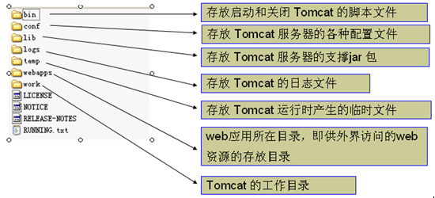
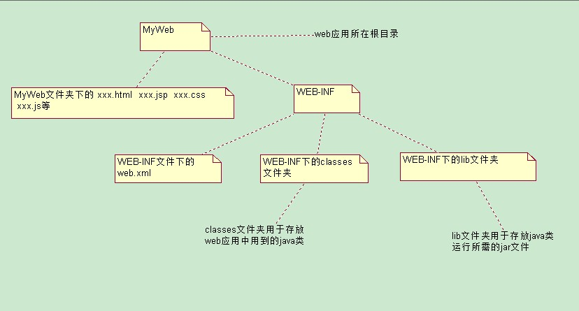

#Tomcat相关知识

1.端口占用

	netstat –an 
	netstat –anb 来查看谁占用8080

2.改变tomcat的端口
到 conf/server.xml 文件中修改

	<Connector connectionTimeout="20000" port="8088" （修改config->server.xml的端口号）
	protocol="org.apache.coyote.http11.Http11NioProtocol" redirectPort="8443"/>

3.tomcat的文件目录结构

	bin: 启动和关闭tomcat的bat文件
	conf: 配置文件 
		server.xml : 该文件用于配置和 server 相关的信息, 比如 tomcat启动端口后,配置Host,  配置Context 即web应用 
		web.xml : 该文件配置与 web应用(web应用就相当于是一个 web站点)
		tomcat-users.xml: 该文件用户配置tomcat 的用户密码 和 权限
	lib 目录: 该目录放置运行tomcat 运行需要的jar包
	logs 目录：存放日志, 当我们需要去查看日志的时候，很有用!,当我们启动tomcat错误时候，可以查询信息.
	webapps 目录: 该目录下，放置我们的web应用(web 站点)
	work: 工作目录: 该目录用于存放jsp被访问后 生成的对应的 server文件 和.class文件

4.web应用目录结构

5.配置tomcat虚拟目录

在tomcat中conf文件夹下的server.xml中的host节点下添加

	<Context path="/webProject" docBase="D:\Project"/> 绝对路径
Context的其他属性：
	reloadable    如果设为ture ，表示 tomcat 会自动更新web应用，这个开销大，建议在开发过程中，可以设为true, 但是一旦真的发布了，则应当设为false;
	upackWAR: 如果设为 ture ，则通过war文件部署的项目会自动解压，否则不自动解压.

6.配置域名

	(1) 在C:\WINDOWS\system32\drivers\etc 下的host文件 添加127.0.0.1 www.baidu.com
	(2) 在tomcat 的server.xml文件添加主机名 
	<Host name="www.baidu.com" appBase="d:\webapp”>
			<Context path="/" docBase="d:\webapp" />
	</Host>

7.配置默认主机

	在tomcat/conf/server.xml 文件
	<Engine name="Catalina" defaultHost="主机名">

8.☆servlet的生命周期(工作原理)

servlet的生命周期(工作流程)

	